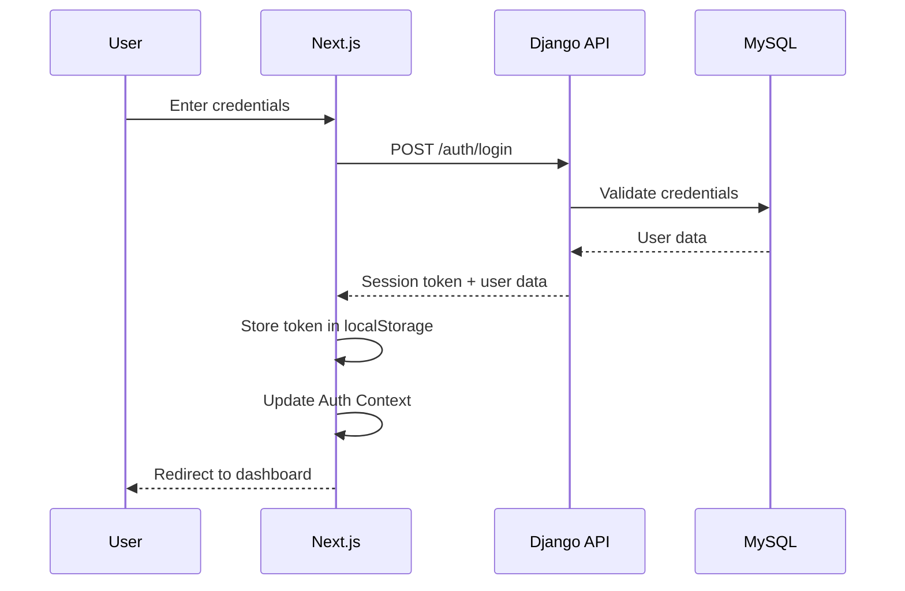

# Django + Next.js Authentication

Fullstack authentication system using **Django-Allauth Headless** for the backend and **Next.js** for the frontend.

## Project Structure

```
learning_project/
├── firstproject/          # Django Backend
│   ├── firstproject/      # Django settings
│   ├── firstapp/          # Your Django app
│   ├── manage.py
│   └── db.sqlite3
├── frontend/              # Next.js Frontend
│   ├── app/              # Next.js app directory
│   ├── lib/              # API wrapper (allauth.ts)
│   ├── contexts/         # Auth context
│   └── package.json
├── Pipfile               # Python dependencies
├── requirements.txt      # Python requirements
└── README.md
```

## Tech Stack

### Backend
- **Django 6.0** - Python web framework
- **Django-Allauth 65.13.1** - Authentication package with headless API
- **Django REST Framework** - API toolkit
- **MySQL** - Database
- **CORS Headers** - Cross-origin resource sharing

### Frontend
- **Next.js 15** - React framework
- **TypeScript** - Type safety
- **Tailwind CSS** - Styling
- **React Context** - State management

## Features

✅ Email/Password Authentication
✅ User Registration & Login
✅ Session Token Management
✅ Protected Routes
✅ Email Verification (optional)
✅ Password Reset
✅ Two-Factor Authentication (MFA)
✅ Social OAuth (130+ providers available)
✅ Modular & DRY Code Architecture

## Setup Instructions

### 1. Backend Setup (Django)

```bash
# Navigate to project root
cd learning_project

# Install Python dependencies
pipenv install

# Or use requirements.txt
pip install -r requirements.txt

# Navigate to Django project
cd firstproject

# Run migrations
pipenv run python manage.py migrate

# Create a superuser (optional)
pipenv run python manage.py createsuperuser

# Run Django development server
pipenv run python manage.py runserver
```

Django backend will run at `http://localhost:8000`

### 2. Frontend Setup (Next.js)

```bash
# Navigate to frontend directory
cd frontend

# Install Node dependencies
npm install

# Run Next.js development server
npm run dev
```

Next.js frontend will run at `http://localhost:3000`

## Usage

### Testing the Authentication Flow

1. **Start both servers**:
   - Django: `http://localhost:8000`
   - Next.js: `http://localhost:3000`

2. **Create an account**:
   - Visit `http://localhost:3000`
   - Click "Get Started" or go to `/auth/signup`
   - Enter email and password
   - Submit the form

3. **Login**:
   - Go to `/auth/login`
   - Enter your credentials
   - You'll be redirected to `/dashboard`

4. **Dashboard**:
   - View your user information
   - Logout when done

### API Endpoints

Django-Allauth Headless exposes these API endpoints at `http://localhost:8000/_allauth/browser/v1/`:

| Endpoint | Method | Purpose |
|----------|--------|---------|
| `/auth/signup` | POST | Register new user |
| `/auth/login` | POST | Login user |
| `/auth/session` | GET | Get current session |
| `/auth/session` | DELETE | Logout user |
| `/auth/email/verify` | POST | Verify email |
| `/auth/password/reset` | POST | Request password reset |
| `/auth/providers` | GET | Get OAuth providers |
| `/mfa/authenticators/totp` | POST | Activate TOTP |
| `/account/password/change` | POST | Change password |

### OpenAPI Documentation

View the full API documentation at:
`http://localhost:8000/_allauth/openapi.html`

## Code Architecture

### Frontend Structure

The Next.js frontend uses a **modular architecture**:

```typescript
// lib/allauth.ts - Modular API wrapper
export class AllauthAPI {
  auth: AuthModule;        // Authentication
  email: EmailModule;      // Email verification
  password: PasswordModule; // Password management
  mfa: MFAModule;          // Multi-factor auth
}

// Usage examples:
await allauth.auth.login(email, password);
await allauth.auth.signup(email, password);
await allauth.auth.logout();
await allauth.password.requestReset(email);
await allauth.mfa.totp.activate();
```

### Authentication Flow



## Configuration

### Django Settings (`firstproject/settings.py`)

Key settings for django-allauth:

```python
# Allauth settings
ACCOUNT_LOGIN_METHODS = {'email'}
ACCOUNT_SIGNUP_FIELDS = ['email*', 'password1*']
ACCOUNT_EMAIL_VERIFICATION = 'optional'
ACCOUNT_SIGNUP_PASSWORD_ENTER_TWICE = False

# Headless mode
HEADLESS_ONLY = True

# Frontend URLs (for email links)
HEADLESS_FRONTEND_URLS = {
    'account_confirm_email': 'http://localhost:3000/auth/verify-email/{key}',
    ...
}

# Token strategy
HEADLESS_TOKEN_STRATEGY = 'allauth.headless.tokens.sessions.SessionTokenStrategy'

# CORS
CORS_ALLOWED_ORIGINS = ['http://localhost:3000']
CORS_ALLOW_CREDENTIALS = True
```

### Environment Variables

Create `.env.local` in the `frontend/` directory:

```env
NEXT_PUBLIC_API_URL=http://localhost:8000
```

## Adding Social Authentication

To add OAuth providers (Google, GitHub, etc.):

1. **Install provider in Django**:

```python
# settings.py
INSTALLED_APPS = [
    ...
    'allauth.socialaccount.providers.google',
    'allauth.socialaccount.providers.github',
]
```

2. **Configure in Django Admin**:
   - Go to `http://localhost:8000/admin`
   - Add Social Application
   - Enter Client ID and Secret from OAuth provider
   - Select your site

3. **Use in frontend**:

```typescript
// Get available providers
const providers = await allauth.auth.getProviders();

// Redirect to provider
await allauth.auth.redirectToProvider('google', callbackUrl);
```

## Troubleshooting

### CORS Errors
- Ensure Django is running on port 8000
- Check `CORS_ALLOWED_ORIGINS` in `settings.py`
- Verify `CORS_ALLOW_CREDENTIALS = True`

### Authentication Not Working
- Check Django console for errors
- Verify MySQL database is running
- Clear localStorage in browser
- Check network tab for API requests

### Module Not Found Errors
- Run `pipenv install` for Python dependencies
- Run `npm install` in frontend directory
- Restart both dev servers

## Production Deployment

### Backend (Django)
- Set `DEBUG = False`
- Use environment variables for secrets
- Configure proper database (PostgreSQL recommended)
- Set `ACCOUNT_EMAIL_VERIFICATION = 'mandatory'`
- Use proper email backend (SendGrid, AWS SES, etc.)
- Configure HTTPS and secure cookies

### Frontend (Next.js)
- Build: `npm run build`
- Deploy to Vercel/Netlify
- Update `NEXT_PUBLIC_API_URL` to production API
- Configure environment variables

## Next Steps

- [ ] Add email verification flow
- [ ] Implement password reset pages
- [ ] Add social OAuth providers
- [ ] Enable two-factor authentication
- [ ] Add user profile management
- [ ] Implement remember me functionality
- [ ] Add rate limiting
- [ ] Deploy to production

## Resources

- [Django-Allauth Documentation](https://docs.allauth.org/)
- [Django-Allauth Headless](https://docs.allauth.org/en/latest/headless/)
- [Next.js Documentation](https://nextjs.org/docs)
- [Django REST Framework](https://www.django-rest-framework.org/)

## License

MIT

---

**Built with ❤️ using Django-Allauth Headless + Next.js**
